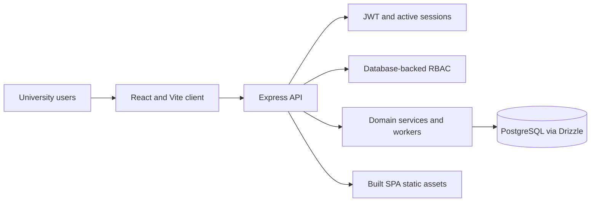
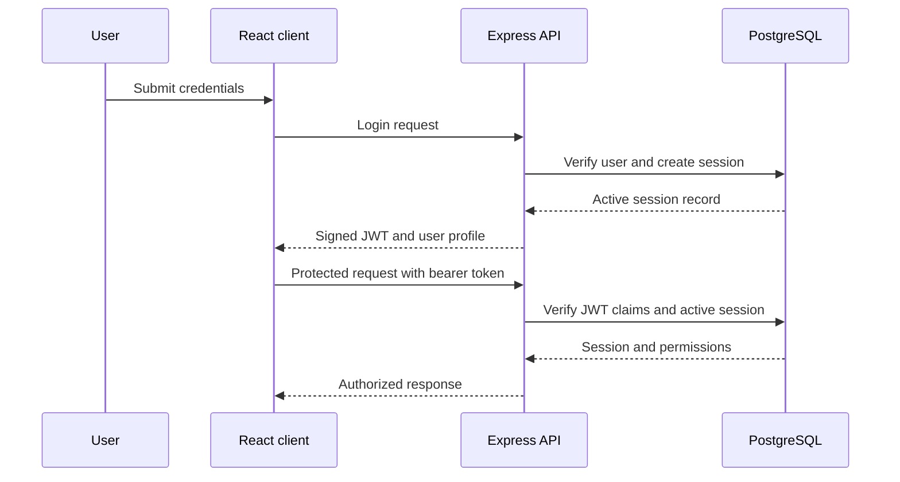
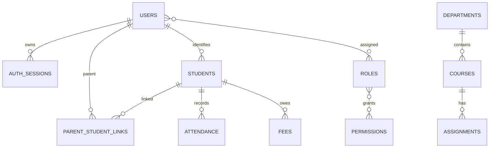
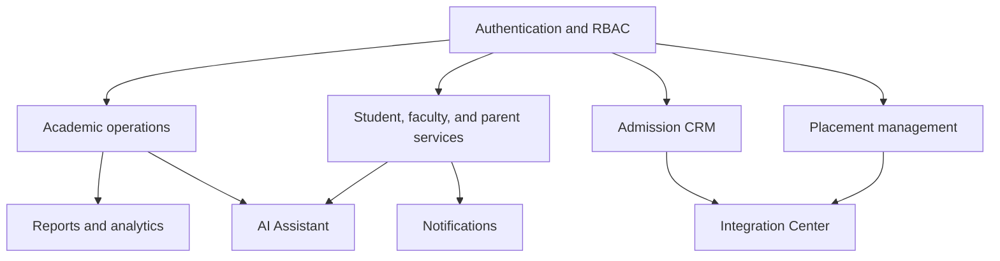

# Project Structure

## Purpose

This document explains the verified repository layout, runtime boundaries, configuration, documentation, and GitHub automation for Enterprise College ERP Version 2.

## Root folders

```text
artifacts/       Runnable application artifacts
lib/             Shared workspace libraries
scripts/         Workspace utility package
docs/            Technical, operational, and visual documentation
.github/         Issue templates, pull request template, CI, and Dependabot
attached_assets/ User-provided reference files; not runtime application code
```

Root configuration includes `package.json`, `pnpm-workspace.yaml`, `pnpm-lock.yaml`, TypeScript project configuration, `.replit`, `.replitignore`, `.gitignore`, `LICENSE`, and repository documentation.

## Frontend

`artifacts/college-erp/` contains the React and Vite application:

```text
src/App.tsx          Route registry and application composition
src/components/      Shared layout and UI primitives
src/pages/           Role and module pages
src/lib/              Frontend utilities
vite.config.ts       Vite build and preview configuration
```

## Backend

`artifacts/api-server/` contains the Express API:

```text
src/app.ts           Middleware, limits, static serving, and error handling
src/routes/          REST route modules
src/middlewares/     Authentication, authorization, and errors
src/services/        Provider-neutral services
src/workers/         Background delivery workers
src/lib/              JWT, password, logging, and server utilities
```

## Shared libraries

- `lib/api-spec/` — API contract source
- `lib/api-zod/` — shared validation types
- `lib/api-client-react/` — React API hooks
- `lib/db/` — database client and schema

## Database

`lib/db/src/schema/` contains the Drizzle PostgreSQL schema. It defines identity, authorization, academic, admissions, placement, parent, AI, notification, and integration records. See [DATABASE.md](DATABASE.md).

## Documentation

Root documentation covers project usage and governance. `docs/` contains architecture, API, database, deployment, environment, installation, release, structure, and visual documentation. [INDEX.md](INDEX.md) is the central documentation map.

## Configuration

- `package.json` — root workspace scripts
- `pnpm-workspace.yaml` — workspace packages, catalogs, overrides, and install policy
- `tsconfig.json` and `tsconfig.base.json` — TypeScript project configuration
- `artifacts/college-erp/vite.config.ts` — frontend build and preview
- `.replit` — Replit workflow and deployment configuration
- `.gitignore` and `.replitignore` — repository and deployment exclusions

## GitHub workflows

`.github/` contains reusable community and maintenance configuration:

- `ISSUE_TEMPLATE/` — bug, feature, documentation, and support forms
- `PULL_REQUEST_TEMPLATE.md` — contribution checklist
- `workflows/ci.yml` — non-deploying typecheck, build, and documentation validation
- `dependabot.yml` — weekly pnpm update checks

## Overall system architecture



## Authentication flow



## High-level database relationships



## ERP module relationships



## Portfolio statistics

The following are verified repository descriptions rather than invented usage metrics:

- **Major ERP modules:** 21 module areas are listed in the public README.
- **Technology stack:** React, TypeScript, Vite, Tailwind CSS, TanStack Query, Wouter, Node.js, Express, PostgreSQL, Drizzle ORM, JWT, and pnpm.
- **Documentation files:** 15 Markdown documents are maintained across the root and `docs/` directories, excluding internal tooling documentation.
- **REST API groups:** The API guide documents authentication, academic, service, dashboard, AI, administration, and integration endpoint groups.
- **Database engine:** PostgreSQL.
- **Authentication model:** Signed JWTs checked against active database-backed sessions, with centralized RBAC and domain ownership checks.

## Related Documentation

- [Documentation index](INDEX.md)
- [Architecture](ARCHITECTURE.md)
- [Database](DATABASE.md)
- [API](API.md)
- [Screenshots](SCREENSHOTS.md)

**Version reference:** Enterprise College ERP `v2.0.0`  
**Last updated:** 2026-08-04